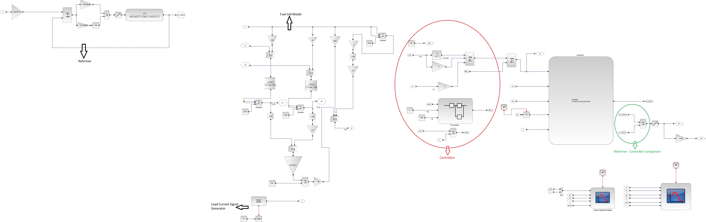
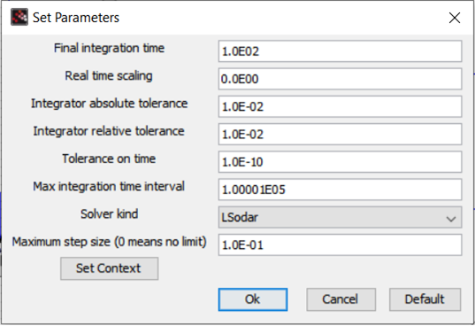

# Input-Output FeedBack Linearization (IOFBL) and Control of a PEM Fuel Cell

## Brief Description
This folder contains the IOFBL-based controller designed for a PEM fuel cell model based on the [Padulles Model1](https://github.com/BoboyeOkeya/PEM_Fuel_Cell_Voltage_Control)

## The Controller Design

The state space representation of the padulles model1 is as shown below

$$    \dot{x_1} = \frac{-x_1}{\tau_{H_2}} + \frac{u_1}{k_{H_2}\tau_{H_2}} - \frac{2K_ru_3}{k_{H_2}\tau_{H_2}} ... (1)
$$

$$\dot{x_2} = \frac{-x_2}{\tau_{O_2}} + \frac{u_2}{k_{O_2}\tau_{O_2}} - \frac{K_ru_3}{k_{O_2}\tau_{O_2}}...(2)$$

$$y = N_o \left[E_o + \frac{RT\ln{x_1}}{2F} + \frac{RT\ln{x_2}}{4F}\right]-u_3r-B\ln{C}-B\ln{u_3}...(3)$$

Where, $x_1$ is the partial pressure of hydrogen(atm), $x_2$ is the partial pressure of oxygen(atm), $u_1$ is the inlet molar flow rate of hydrogen(kmol/s), $u_2$ is the inlet molar flow rate of oxygen(kmol/s), $u_3$ is the fuel cell stack current(A)--which we will consider as an input for this control design. $y$ is the fuel cell stack output voltage(V), $k_{H_2}$ is the hydrogen valve constant(kmol/atm.s), ${\tau_{H_2}}$ is hydrogen flow time constant(s), $K_r = \frac{N_o}{4F}$ is a constant(kmol/s.A), $N_o$ is the Number of cells, $F$ is the Faraday's constant (C/kmol). $k_{O_2}$ is the oxygen valve constant (kmol/atm.s), $\tau_{O_2}$ is the oxygen time constant(s). $E_o$ is the no-load open-circuit voltage(V), $R$ is the universal gas constant(J/kmol.K), $T$ is the fuel cell stack temperature(K), $r$ is the fuel cell internal resistance($\Omega$), $B$ is the activation voltage constant(V), $C$ is the activation constant parameter(1/A).

From the above state-space representation, it becomes obvious that the system is a multiple-input, single output (MISO) system.

The steps for the IOFBL-based controller are as shown below:

**1. Express the state space equations 1,2,3 above in the form below [1]**

$$
    \dot{x} = f(x) + \sum_{i=1}^{m}{g_i(x)u_i}...(4)
$$

$$    y_i = h_i(x)...(5)
$$

**2. In order to use the IOFBL technique the number of outputs(1) needs to be equal to the number of inputs(3) so that the decoupling matrix becomes a square matrix. To achieve this, our state-space with 2 states is padded with two extra states ($x_3$ and $x_4$) thus transforming the MISO system into a MIMO system such that:**

$$\begin{equation}
\begin{bmatrix}
  \dot{x_3}\\
  \dot{x_4}\\
\end{bmatrix} = \begin{bmatrix}
  u_2\\
  u_3\\
\end{bmatrix} 
\end{equation}...(6)$$

$$\begin{equation}
\begin{bmatrix}
    {x_3}\\
  {x_4}\\
\end{bmatrix} = \begin{bmatrix}
  h_2(x)\\
  h_3(x)\\
\end{bmatrix} 
\end{equation}...(7)$$

 Hence, from equations 1-7, we can re-express the state-space as shown below:

$$
\begin{bmatrix}
  \dot{x_1} \\
  \dot{x_2}\\
    \dot{x_3} \\
  \dot{x_4}\\
\end{bmatrix}  = \begin{bmatrix}
  \frac{-x_1}{\tau_{H_2}}\\
  \frac{-x_2}{\tau_{O_2}}\\
    0\\
  0\\
\end{bmatrix} + \begin{bmatrix}
  \frac{1}{k_{H_2}\tau_{H_2}}\\
  0\\
    0\\
  0\\
\end{bmatrix}u_1 + \begin{bmatrix}
 0\\
  \frac{1}{k_{O_2}\tau_{O_2}}\\
    1\\
  0\\
\end{bmatrix}u_2+\begin{bmatrix}
  \frac{-2K_r}{k_{H_2}\tau_{H_2}}\\
  \frac{-K_r}{k_{O_2}\tau_{O_2}}\\
    0\\
  1\\
\end{bmatrix}u_3...(8)
$$

$$
\begin{bmatrix}
  {y_1} \\
  {y_2}\\
    {y_3} \\
\end{bmatrix} = \begin{bmatrix}
  V_{FC}\\
  x_3\\
x_4\\
\end{bmatrix} = \begin{bmatrix}
h_1(x)\\
  h_2(x)\\
  h_3(x)\\
\end{bmatrix}...(9)
$$

**3. Next, we will be differentating the output vector $y_j$ until at least one of the outputs is directly related to at least one of the inputs $u_i$. This differential operation is expressed by the equation below [1]:**

$$\begin{equation}
    \dot{y_j} = L_fh_j + \sum_{i=1}^{m}{(L_{g_i}h_j)u_i}...(10)
\end{equation}$$

Where $L_fh_j$ are the lie derivatives of the function $h_j(x)$ WRT to $f(x)$ and $L_{g_i}h_j$ are the lie derivatives of the function $h_j(x)$ WRT to $g_i(x)$.

For our model, we have the following:

$$
\begin{bmatrix}
  \dot{y_1} \\
  \dot{y_2}\\
    \dot{y_3} \\
\end{bmatrix}  = \begin{bmatrix}
  L_fh_1\\
  L_fh_2\\
    L_fh_3\\
\end{bmatrix} + \begin{bmatrix}
  L_{g_1}h_1 & L_{g_2}h_1 & L_{g_3}h_1\\
  L_{g_1}h_2 & L_{g_2}h_2 & L_{g_3}h_2\\
  L_{g_1}h_3 & L_{g_2}h_3 & L_{g_3}h_3\\
\end{bmatrix}\begin{bmatrix}
  u_1\\
  u_2\\
    u_3\\
\end{bmatrix}...(11)
$$

For our model, the decoupling matrix is as shown below.

$$
E(x) = \begin{bmatrix}
  L_{g_1}h_1 & L_{g_2}h_1 & L_{g_3}h_1\\
  L_{g_1}h_2 & L_{g_2}h_2 & L_{g_3}h_2\\
  L_{g_1}h_3 & L_{g_2}h_3 & L_{g_3}h_3\\
\end{bmatrix}...(13)
$$

And if the decoupling matrix is non-singular, then we can derive a control input signal U such that:

$$
U = \begin{bmatrix}
  u_1\\
  u_2\\
    u_3\\
\end{bmatrix} =-E^{-1}\begin{bmatrix}
  L_fh_1\\
  L_fh_2\\
    L_fh_3\\
\end{bmatrix} + E^{-1}\begin{bmatrix}
  v_1\\
  v_2\\
    v_3\\
\end{bmatrix}...(14)
$$

By putting equation 14 into 11, we will arrive at a new system with new control inputs as shown below:

$$\begin{equation}
\begin{bmatrix}
  \dot{y_1} \\
  \dot{y_2}\\
    \dot{y_3} \\
\end{bmatrix}  = \begin{bmatrix}
  v_1\\
  v_2\\
    v_3\\
\end{bmatrix}
\end{equation}...(15)$$

These computations can be done using a symbolic solver. MATLAB was used to solve these computations; the script and the result of U are available in `lie_derivative_solver.m`.

The result of the computation showed that $u_2 =v_2$ and $u_3 = v_3$, so the only new control signal used for the setpoint tracking is $v_1$ which is equal to $\dot{y_1}$. The new control signal is then selected as follow:

$$\begin{equation}
v_1 = \dot{y_1} = \dot{y_1^d} - k_1(y_1 - y_1^d)...(16)
\end{equation}$$

Where ${y_1^d}$ is the voltage reference or setpoint, ${y_1}$ is fuel cell stack voltage output. And $k_1$ is the desired pole.

Also, a tracking error controller can be added into the system, which makes the control input $v_1$ to be of the form:

$$\begin{equation}
v_1 = \dot{y_1} = \dot{y_1^d} - k_1(y_1 - y_1^d) - K_p(y_1 - y_1^d) - Ki\int(y_1 - y_1^d) dt ...(17)
\end{equation}$$

Where $K_p$ is the proportional gain and $K_i$ is the integral gain.

With this, the design is almost ready, the next step is to build the computational simulations for the control system. The control diagram is similar to the one showed in [2] as shown below:

**4. The control system is designed on Xcos and the diagram is shown in figure below:**

The Scilab script and the xcos model are available in the files `nonlinear_control_law.sci` and  `padulles1_IOFBL_Control.zcos`. The simulation parameters are available in `nonlinear_control_law.sci`.

## The Results

To test the IOFBL-based control system, it was given a voltage output setpoint of 24V, a load current profile that changes over time, and the pole was adjusted until the system became stablized at the setpoint --the selected pole is at -1e8. Also, the solver settings had to be adjusted, the settings that produced the results shown in the process are shown below:

The results are shown in the figure below

It can be seen that there are steady state errors even in the absence of a PI tracking controller. The errors range from 0.112V to -0.874V.

Apart from this, the system becomes unstable when the setpoint is changed to values other than 24V. For example, the figure below shows the system response for a setpoint of 20V.

Therefore, a more robust nonlinear controller is needed.

## References
[1]  J. J. E. Slotine and W. Li, “Applied Nonlinear Control." Englewood 
Cliffs, NJ: Prentice-Hall, 1991. 

[2] Chang, L.-Y.; Chen, H.-C. Linearization and Input-Output Decoupling for Nonlinear Control of Proton Exchange Membrane Fuel Cells. Energies 2014, 7, 591-606. https://doi.org/10.3390/en7020591
