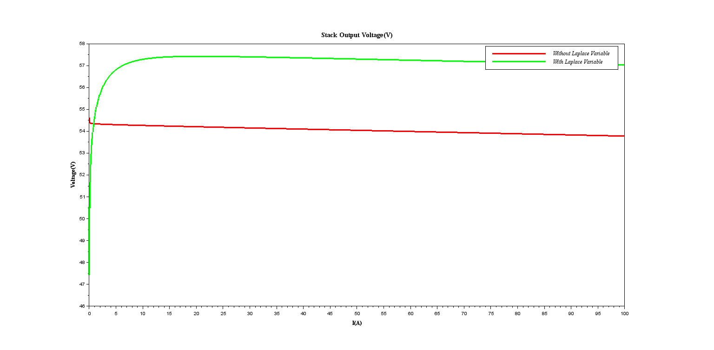
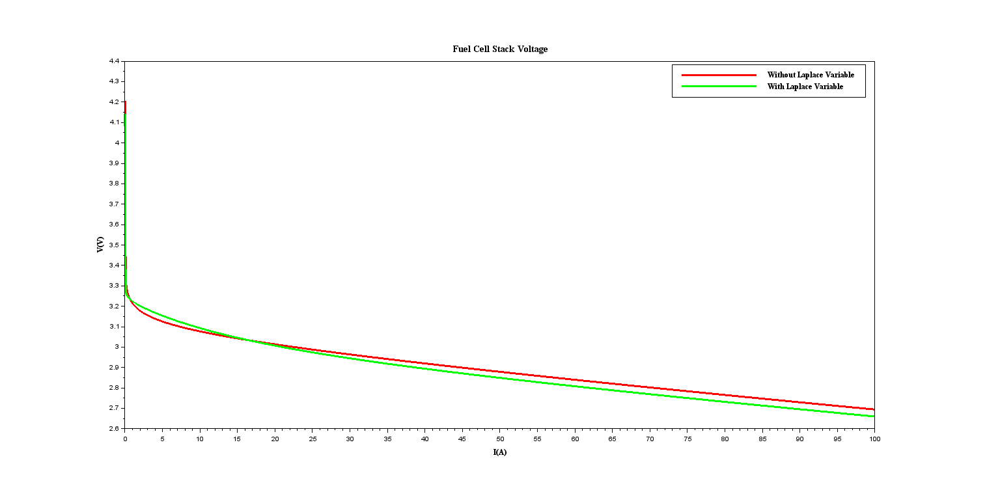

# Modelling of Fuel Cells

## Brief Description
These files represent my attempts to model a fuel cell--it could either be a Proton Exchange Membrane Fuel Cell(PEMFC) or a Solid Oxide Fuel Cell.

There are various models available in the body of knowledge, my repo has the following:

### **A. `padulles_model.zcos`:** 

This is a dynamic model that I designed in Xcos according to this model diagram shown in the figure below obtained from [1][2]. 

There is also a huge open source repository for Fuel cell simulation tools that contains a lot of other models, you can reach them through this link [opem](https://github.com/ECSIM/opem).

This model represents a `PEMFC`, which are low-temperature devices. And in their operation it is assumed that its water by-product does not evaporate, hence the pressure of water ($P_{H_2O}$) is omitted. However, this is not true for an SOFC.

Please, kindly note that I have validated the model in `padulles_model.zcos` against the results presented in [Padulles Dynamic Model I](https://www.ecsim.ir/opem/doc/Dynamic/Padulles1.html). The model results are shown below

Although, these results are similar to the results in [Padulles Dynamic Model I](https://www.ecsim.ir/opem/doc/Dynamic/Padulles1.html) . I observed a slightly different result when I included the laplace `s` variable. For example, the fuel stack's output voltage increased. The comparison is shown below:

Based on the original paper [1],these model is based on a lot of assumptions which can be found in the overview section of [Padulles Dynamic Model I](https://www.ecsim.ir/opem/doc/Dynamic/Padulles1.html).

### **B. `padulles_model2.zcos`:** 

I also designed this in Xcos according to the model that can be found in the open source fuel cell simulator. However, this includes the water by-product. Hence, I would say that this describe a high temperature device such as the `SOFC`, since it accounts for the pressure of water vapour--caused when the water by-product evaporates at high temperature. The Xcos model diagram follows the diagram shown on this [opem page](https://www.ecsim.ir/opem/doc/Dynamic/Padulles2.html) and the validation results can be found in the file directory `Figures/` above. The results are prefixed with `padulles2_`.

Also, the results--mine and the open simulator's--were similar but when I include the laplace `s` variable, there is a slight difference between. The fuel cell stack's output voltage comparison is shown in figure below .

This model is also based on some assumptions as can be found in the overview section of [Padulles Dynamic Model II](https://www.ecsim.ir/opem/doc/Dynamic/Padulles2.html)

### **C. `fuel_cell.zcos`:**

This is a state-space representation where

$x_1$ = pressure of hydrogen $P_{H_2}$

$x_2$ = pressure of oxygen $P_{O_2}$

$x_3$ = Fuel Cell stack current $I_{FC}$

$x_4$ = Fuel Cell Output Voltage $V_{FC}$

$u$ = The inflow rate of Hydrogen $q_{H_2}$

Kindly note that this model is not functioning and it has not been properly validated against research results.

## References
[1] Padullés, Joel & Ault, G.W & Mcdonald, J.R.. (2000). Integrated SOFC plant dynamic model for power systems simulation. Journal of Power Sources. 86. 495-500. 10.1016/S0378-7753(99)00430-9. 

[2] Sepand Haghighi, Kasra Askari, Sarmin Hamidi, Mohammad Mahdi Rahimi (2018), {OPEM} : Open Source {PEM} Cell Simulation Tool. Journal of Open Source Software, vol(3), number(27),pages(676),https://doi.org/10.21105/joss.00676
